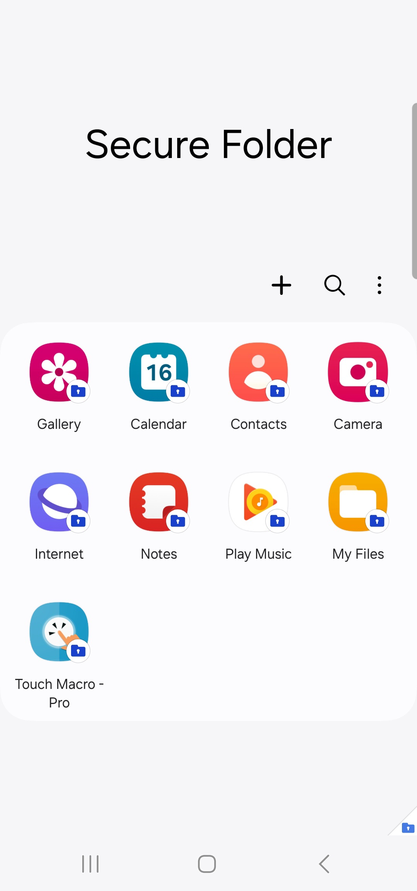
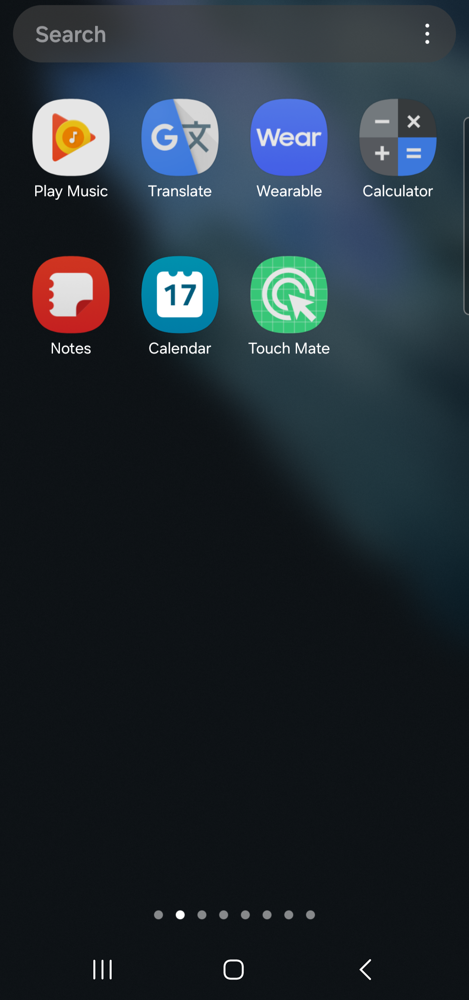
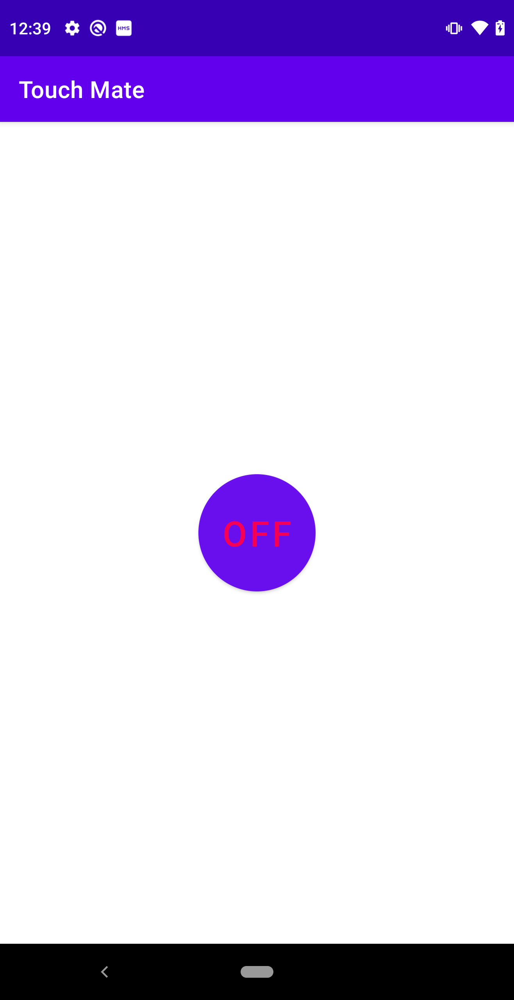

# 터치 메이트
터치 매크로 앱을 보안폴더 또는 워크스페이스에 설치할 경우 접근성 권한을 사용할 수가 없기 때문에 클릭 기능이 동작하지 않습니다. 터치 메이트는 보안폴더 또는 워크스페이스에 설치된 터치 매크로 앱의 클릭 기능이 동작하게 도와줍니다. 터치 메이트를 접근성을 사용할 수 있는 일반 앱 설치 영역에 설치하고, 터치 매크로는 보안폴나 워크스페이스에 설치하세요. 터치 매크로 앱을 설치해야 터치 메이트가 동작합니다.

## 설치
- 터치 메이트 앱을 다운로드합니다.

  [다운로드](apk/README.md)

- 터치 매크로 앱을 보안폴더 안에 설치합니다.

  

- 터치 메이트는 보안폴더가 아닌 곳에 설치하세요.

  

## 실행
- 접근성 권한을 허용합니다.
- 터치 메이트 서비스를 실행합니다.

  

## 접근성 권한 
 - Android 14 스마트폰에서 접근성 권한을 활성화 하는 동영상입니다.
 
   

